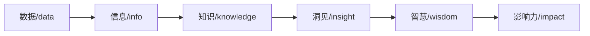
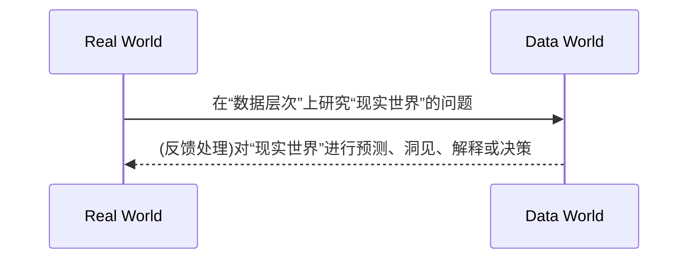
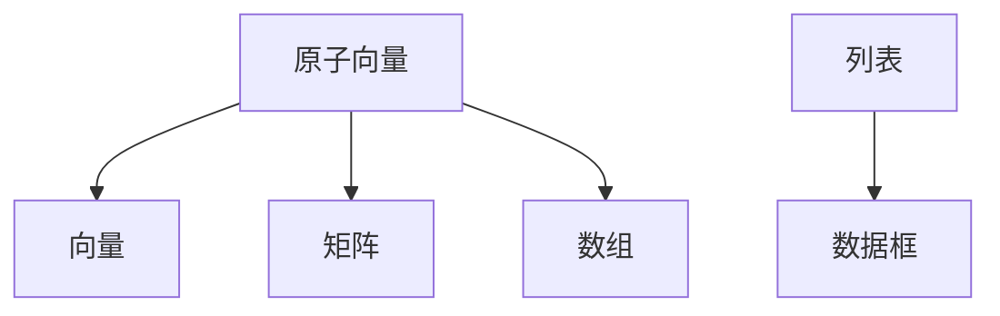

## DATA SCIENCE
# 1. Introduction to Data Sciencce

- 第四范式

   实验科学 -> 理论科学 -> 计算科学 -> 数据密集型科学发现

在数据科学中，各种符号（如字符、数字等）的组合、语音、图形、图像、动画、视频、多媒体等统称为数据.

|类型	|含义	|本质|	举例|
|---|---|---|---|
|结构化数据	|直接可以用传统关系数据库存储和管理的数据	|先后结构，后有数据	|关系数据库中的数据
|非结构化数据|	无法用关系数据库存储和管理的数据|	没有（或难以发现）统一结构的数据	|语音、图像文件
|半结构化数据	|经过一定转换处理后可以用传统关系数据库存储和管理的数据。|	先后数据，后有结构（或较容易发现其结构）|	HTML、XML文件等|

- level of data processing: 0原始数据 1干净数据 2增值数据 3洞见数据



- 数据科学是以数据为中心的科学

以“数据”，尤其是**“大数据”**为研究对象是一门，并以统计学、机器学习、数据可视化等为理论基础，主要研究数据预处理、数据管理、数据计算等活动的交叉性学科。


## Big data

美国国家科学基金会定义大数据为“大型、多样、复杂的、纵向的，和/或基于仪器、传感器、互联网交易、电子邮件、视频和点击流等产生的分布式数据集，和/或所有现在和未来可用的其他数字源”。

- 两个内涵

      1.研究数据本身，研究数据的各种类型、状态、属性及变化形式和变化规律；

      2.为自然科学和社会科学研究提供一种新的方法，称为科学研究的数据方法，其目的在于揭示自然界和人类行为现象和规律。


- Process of data science


## Machine Learning(ML)

机器学习(Machine Learning, ML)是一门多领域交叉学科，涉及概率论、统计学、逼近论、凸分析、算法复杂度理论等多门学科。专门研究计算机怎样模拟或实现人类的学习行为，以获取新的知识或技能，重新组织已有的知识结构使之不断改善自身的性能。

## Common tools
!!! info "Common tools"
      - 数据科学语言工具：R、PYTHON、CLOJURE、HASKELL、SCALA等
      - 传统数据库和数据仓库工具：SQL、RDMS、DW、OLAP等
      - NOSQL工具：MONGODB、COUCHBASE、CASSANDRA等
      - 支持大数据计算的工具：HADOOP HDFS&MAPREDUCE、SPARK、STORM等
      - 支持大数据管理、存储和查询的工具：HBASE、PIG、HIVE、IMPALA、CASCALOG- 等
      - 支持数据采集、聚合或传递的工具：WEBSCRAPER、FLUME、AVRO、SQOOP、HUME- 等
      - 支持数据挖掘的工具：WEKA、KNIME、RAPIDMINER、SCIPY、PANDAS等
      - 支持数据可视化的工具：GGPLOT2、D3.JS、TABLEU、SHINY、FLARE、GEPHI等
      - 数据统计分析工具：SAS、SPSS、MATLAB等

1.NoSQL

{==不需要固定的表结构，通常也不存在连接操作。在大数据存取上具备关系型数据库无法比拟的性能优势==}

非关系型数据库以键值对存储，它的结构不固定，每一个元组可以有不一样的字段，每个元组可以根据需要增加一些自己的键值对，这样就不会局限于固定的结构，可以减少一些时间和空间的开销。

2.Hadoop

3.SPARK

## Basic steps
!!! success "Basic steps"
      - 掌握数学、统计学及计算机科学、机器学习
      - 拥抱AI大模型技术
      - 学会写代码
      - 掌握数据库技术：RDBMS,NOSQL
      - 探究数据科学流程
      - 重视大数据
      - 成长、协作与学习
      - 参与实际工作，彻底投入实践
      - 参与社区


# 2. Visualazaiton Tech

**visualization**:data info -> visual formation

 - components:
      1. spatial sub - strate(空间基)
      2. graph ele (图形元素)
      3. graph (图形属性)

- R 

      - defaulted: graphics 

      - most powerful one: ggplot2

         ~~~R
         # installment
         
         ~~~

!!! note "basic graphics"

      1. 散点图(scatter)

         can be used to indicate underlying connections bet. parameters( dep. on the dimentionary of them). Usually applied f 2d statistics in a *Catesian* codt.(coordination).

      2. 折线图

      3. 条形图/柱形图(bar)

         includes dif. color, length, fill etc. to perform *same&diffenrence* among multiple statistics.

      4. 饼图(pie)

      5. 直方图(histogram)

         display the statistic characteristics(PDF)

      6. 箱线图(box-plot)

- advanced graphics

  1. 热力图(hitmap)

     display cross level, both horizonal direction and vertical direction(multiple comparison). It can be allaied with cluster graphics

  2. 

- ggplot2

  from *specific statistics* to *geometry objects(geom)*

  ~~~
  plot - aesthetics - geometry
  ~~~

  **R** can save the drawing process(use "/*+..." to append more set) -> overlap other layers

  ~~~R
  # initial-> build layers -> adjust
  # common aesth.: axis(x,y), color, size, shape, fill, alpha(透明度)
  
  # scatter
  # statistics transform
  ggplot(mpg, aes(trans, cty))+
  geom_point()+
  geom_point(stat = "summary", fun = "mean", color = "red", size = 4) # apply another graph above the former ones
  
  
  ~~~

## Map

~~~ R
install.packages("maps")
install.packages("mapproj")
library(maps)
library(ggplot2)
states_map <- map_data("state") # load data and write into virable

ggplot(states_map, aes(x=long,y=lat,group=group)) +
geom_polygon(fill="white",colour="black") # 绘制多边形, 可以填充颜色

ggplot(states_map, aes(x=long,y=lat,group=group)) +
geom_path() + coord_map("mercator") # 绘制路径
~~~

## Network(网络图)

使用igraph包. igraph 是一个项目，目标是建立一条简单，易用的网络分析工具，有 R, python, C/C++ 等语言的具体实现。

- 安装包: 
~~~R
install.packages("igraph") 
library(igraph)
~~~
- 有向图无向图:
~~~R
# 有向图
gd <- graph(c(1,2, 2,3, 2,4, 1,4, 5,5, 3,6))
plot(gd)
# 无向图
gu <- graph(c(1,2, 2,3, 2,4, 1,4, 5,5, 3,6),directed=FALSE)
plot(gu,vertex.label=NA)
~~~

## Output Format

- "PDF"
~~~R
# 使用pdf()打开pdf图形设备，绘制图形，dev.off()关闭图形设备。
pdf("d:/myplot.pdf",width=4,height=4)
print(ggplot(mtcars,aes(x=wt,y=mpg))+geom_point())
# 或者plot(mtcars$wt,mtcars$mpg)
dev.off()
~~~
      
- "png"
~~~R
# 用png()打开png图形设备，绘制图形，dev.off()关闭图形设备。
ppi <- 300
png("d:/myplot_%d.png",width=4*ppi,height=4*ppi,res=ppi)
plot(mtcars$wt,mtcars$mpg)
print(ggplot(mtcars,aes(x=wt,y=mpg))+geom_point())
dev.off()
~~~


# 3. R

- 安装包: install.packages()

## Variable
!!! note "判断(is)/修改(as)数据类型"
      is.numeric()：是否数值型数据  
      is.character()：是否字符型数据  
      is.vector() ：是否向量数据    
      is.matrix() ：是否矩阵数据  
      is.data.frame() ：是否数据框数据  
      is.factor() ：是否因子数据  
      is.logical() ：是否逻辑型数据  

### Vector
**相同基本类型**, 可以进行数学运算

- 访问特定数据  
x[n] ： 访问下标/名称为n的向量元素，下标从1开始。  
x[-n]：访问除了下标/名称为n的元素之外的所有其他元素  
x[索引向量]: 访问索引向量指定的所有元素  
x[-排除向量]: 访问排除向量指定的元素之外的所有其他元素。（使用名字时需要构造排除名字向量与原来名字向量之间比较后的逻辑向量{==i.e.不能自己进行比较, 需要输入逻辑向量==}）

=== "R"
      ~~~ R title="some usages.r"
      names(ages) # get names
      names(x) <- c("n1","n2") # take names

      x[2] <- 125     # 改变一个元素
      x[c(1,3)] <- c(144, 169)   # 改变部分元素
      x[c(1,3)] <- 0   # 部分元素赋予同一个值
      x[] <- 0   #  所有元素赋予相同值

      1.00 %in% x # 判断是否存在, 可以给多个值, 分别给出TF
      ~~~

=== "Python"
      ~~~ py
      向量操作对应的python实现如下：

      import numpy as np

      # 创建向量
      x = np.array([1, 2, 3])
      y = np.array([4, 5, 6])

      # 向量加法和减法
      z1 = x + 1
      print(z1)
      z2 = y - x
      print(z2)
      # 创建带名字的字典
      ages = {"Li": 33, "Zhang": 29, "Liu": 18}


      # 给 x 添加名字
      x = np.array([1, 2, 3], dtype='object')
      x_names = ["name1", "name2", "name3"]
      x = dict(zip(x_names, x))

      # 访问元素
      print("ages[1]:", list(ages.values())[0])  # 通过索引访问
      print("ages['Li']:", ages["Li"])  # 通过名字访问
      print("x['name1', 'name3']:", [x["name1"], x["name3"]])  # 通过名字访问多个元素

      # 索引操作
      print("x[1, 3]:", [x["name1"], x["name3"]])  # 通过名字访问多个元素


      # 排除操作
      print("x[-(1:2)]:", list(x.values())[2:])  # 排除前两个元素
      print("x[-3]:", list(x.values())[:2])  # 排除第三个元素
      print("x[x < 10]:", [i for i in x.values() if i < 10])  # 条件筛选


      # 访问 ages
      print("ages['Li', 'Liu']:", {k: v for k, v in ages.items() if k in ["Li", "Liu"]})  # 通过名字访问多个元素
      print("ages[names(ages) != 'Li']:", {k: v for k, v in ages.items() if k != "Li"})  # 排除 'Li'
      print("ages[!names(ages) %in% c('Li', 'Zhang')]:", {k: v for k, v in ages.items() if k not in ["Li", "Zhang"]})  # 排除 'Li' 和 'Zhang'

      # 修改元素
      x["name2"] = 125  # 改变一个元素
      x["name1"] = 144
      x["name3"] = 169  # 改变部分元素
      x["name1"], x["name3"] = 0, 0  # 部分元素赋予同一个值
      x = {k: 0 for k in x.keys()}  # 所有元素赋予相同值

      print("Modified x:", x)

      ~~~

### Matrix & Array
矩阵(matrix): 由行和列构成的二维数据结构，所有元素必须是{==相同类型的==}，和数学上的矩阵一样，矩阵实际上是{==二维数组==}。  
矩阵就是一种特殊的数组, 因为是二维的情况, 可以配合LA的运算进行数学处理
~~~ R title="创建矩阵"
matrix(
data,    # 提供源数据的向量
nrow,   # 行数
ncol,    #  列数
byrow=FALSE,   # {==byrow=TRUE按行填充，默认按列填充==}, 也就是按照特定规则去把这个一维数组填进去
dimnames=NULL    # 行列各个维度的名字，需要以列表形式提供
)
# 例如：
m1 <- matrix(1:6, nrow=2, dimnames=list(c("r1","r2"),c("c1","c2","c3")))

# 也可以直接用向量去填充
a=1:24
dim(a)=c(6,4)
# 对于建好的矩阵，可以使用dimnames()函数命名各个维度
dimnames(a) <- list(c("r1","r2","r3","r4","r5","r6"),c("c1","c2","c3","c4"))

~~~

!!! note "calculus of matrix"
      A + x  :  矩阵的每个元素都与标量x运算，得到结果矩阵，可以使用+、-、\*、\/ 等算术运算。  
      A + B :   矩阵加法  
      A %*% B ： 矩阵乘法  
      A \* B : 对应数字相乘, 等价于\/\*   
      t(A)  ： 矩阵的转置  
      nrow(A) :  求矩阵的行数  
      ncol(A) :  求矩阵的列数

- 元素或者子集的访问
{==和Matlab不同, 不需要加占位符“:”表示全体, 直接空下就可以进行匹配==}  
~~~ R title="数组处理"
X[i,j]                     #下标为(i,j)的元素  
X[i,]                      #第i列  
X[,j]                      #第j列  
X[,c(1,3)]             #第1,3列  
X[“name”,]           #名为”name”的行

rbind(a1, a2)
cbind(a1, a2) # 在保证维数匹配的情况下可以拼接
~~~

### list
{==上面的vector和array都是原子型数据(Atomic), 通过对索引取名字可以达到“键值对”的效果, 但是改变不了数据属性的本质==}

!!! warning "list"
      列表是R中唯一能存储复合数据的结构：
      元素可以是任意类型（向量、数组、其他列表等）。
      天然支持键值对（通过名字访问）：

- 列表的常用操作函数

|​函数	|​用途	|​示例|
|--|--|--|
|length()	|返回列表元素个数	|length(my_list)|
|names()	|获取或设置列表元素名称	|names(my_list) <- c("a", "b")|
|str()	|查看列表结构|	str(my_list)|
|lapply()	|对列表每个元素应用函数	|lapply(my_list, sum)|
|sapply()	|简化 lapply 的输出|	sapply(my_list, mean)|
|do.call()	|将列表作为函数参数	|do.call(rbind, list_of_dfs)|
|append()	|合并多个列表	|append(list1, list2)|

=== "访问"
      ~~~ R
      # 1. 创建一个示例列表
      # ----------------------------
      my_list <- list(
      vec = c(1, 2, 3),                # 数值向量
      mat = matrix(1:4, nrow = 2),     # 2x2矩阵
      char = "hello",                   # 字符标量
      sub_list = list(a = 1, b = 2)     # 嵌套列表
      )

      # 查看列表结构
      str(my_list)

      # ----------------------------
      # 2. 列表访问操作
      # ----------------------------

      # (1) 按索引位置访问
      cat("\n按索引访问:\n")
      my_list[[i]]       # 返回第i个元素（向量）
      my_list[i]         # 返回包含第i个元素的子列表, 也可以向内部传入向量进行提取, 结果将是一个子列表

      # (2) 按元素名称访问
      cat("\n按名称访问:\n")
      my_list$vec        # 使用\$运算符
      my_list[["vec"]]   # 使用[[ ]]运算符
      my_list["vec"]     # 返回包含vec的子列表

      # (3) 访问嵌套列表元素
      cat("\n访问嵌套列表:\n")
      my_list$sub_list$b    # 访问嵌套列表中的b元素
      my_list[[4]][["b"]]   # 等价写法

      # (4) 使用逻辑索引访问
      cat("\n逻辑索引访问:\n")
      my_list[sapply(my_list, is.numeric)]  # 只提取数值型元素
      ~~~

=== "修改"
      ~~~ R
      # (1) 修改现有元素
      cat("\n修改元素:\n")
      my_list$vec <- c(10, 20, 30)       # 修改向量元素
      my_list[["char"]] <- "world"       # 修改字符元素
      my_list[[4]]$b <- 99               # 修改嵌套列表中的元素

      # (2) 添加新元素
      cat("\n添加元素:\n")
      my_list$new_vec <- rnorm(3)       # 添加随机向量
      my_list[["new_mat"]] <- diag(2)   # 添加单位矩阵

      # (3) 删除元素{++也就是通过赋值为NULL实现++}
      cat("\n删除元素:\n")
      my_list$char <- NULL              # 删除字符元素
      my_list["mat"] <- NULL            # 删除矩阵元素

      # (4) 批量修改
      cat("\n批量修改:\n")
      names(my_list) <- paste0("element_", seq_along(my_list))  # 重命名所有元素

      # ----------------------------
      # 4. 修改后验证
      # ----------------------------
      cat("\n修改后的列表结构:\n")
      str(my_list)

      # =============================================
      # 输出说明:
      # 1. 使用cat()分隔不同操作部分
      # 2. 每个操作后都有明确的注释说明
      # 3. str()函数用于验证结构变化
      # =============================================
      ~~~
### Data Frame
~~~ R title="数据框（Data Frame）指南"

# ===== 1. 创建数据框 =====
# 基础创建方法
my_df <- data.frame(
  ID = 1:5,
  Name = c("张三", "李四", "王五", "赵六", "钱七"),
  Age = c(23, 34, 28, 45, 31),
  Score = c(88.5, 92.0, 76.5, 64.0, 95.5),
  stringsAsFactors = FALSE
)

# 从矩阵转换
my_matrix <- matrix(1:9, ncol = 3, dimnames = list(NULL, c("A", "B", "C")))
matrix_to_df <- as.data.frame(my_matrix)

# 从列表转换
my_list <- list(Product = c("A", "B", "C"), Price = c(12.5, 8.9, 15.0))
list_to_df <- as.data.frame(my_list)

# ===== 2. 数据框基础操作 =====
# 查看数据结构
str(my_df)
head(my_df, 3)  # {==查看前3行==}
tail(my_df, 2)  # {==查看后2行==}
summary(my_df)  # 统计摘要

# 获取维度信息
nrow(my_df)
ncol(my_df)
dim(my_df) # {++这个操作是无关数据类型的, 直接统计元素维数++}

# 列名操作
names(my_df)
colnames(my_df)[2] <- "FullName"  # 修改列名
names(my_df) <- c("ID", "Name", "Age", "Score")  # 重置所有列名

# ===== 3. 数据访问与子集 =====
# 按列访问
my_df$Age
my_df[["Score"]]
my_df["Name"]  # 保持数据框结构

# 按行列索引访问
my_df[1:3, ]  # 前3行
my_df[, c("ID", "Name")]  # 指定列
my_df[my_df$Age > 30, ]  # 条件筛选

# 使用subset函数
subset(my_df, Score > 80, select = c(Name, Score))

# ===== 4. 数据修改 =====
# 添加新列
my_df$Grade <- c("A", "B", "C", "D", "A") # 创建新的列并填充元素
my_df <- transform(my_df, 
                  AgeGroup = ifelse(Age < 30, "Young", "Old"))

# 修改数据
my_df$Score[1] <- 90.0
my_df[my_df$Name == "李四", "Age"] <- 35

# 删除列
my_df$Grade <- NULL
my_df <- subset(my_df, select = -AgeGroup)

# ===== 5. 数据排序 =====
# 单列排序
my_df[order(my_df$Score), ]  # 升序
my_df[order(-my_df$Score), ]  # 降序

# 多列排序
my_df[order(my_df$Age, -my_df$Score), ]

# ===== 6. 数据框合并 =====
# 创建第二个数据框
new_data <- data.frame(
  ID = 3:6,
  Department = c("HR", "IT", "Finance", "Marketing"),
  Salary = c(5000, 6500, 7000, 5500)
)

# 按列合并
merged_data <- merge(my_df, new_data, by = "ID", all.x = TRUE)

# 按行合并
extra_row <- data.frame(ID = 6, Name = "孙八", Age = 29, Score = 82.0)
combined_df <- rbind(my_df, extra_row)

# ===== 7. 数据聚合 =====
# 基本聚合
aggregate(Score ~ Age, data = my_df, mean)

# 使用dplyr（需安装）
if(require(dplyr)){
  my_df %>%
    group_by(Age > 30) %>%
    summarise(AvgScore = mean(Score),
              MaxScore = max(Score))
}

# ===== 8. 缺失值处理 =====
# 引入缺失值
my_df$Score[3] <- NA

# 检测缺失
complete.cases(my_df)

# 处理缺失
na.omit(my_df)  # 删除含NA的行
my_df$Score[is.na(my_df$Score)] <- mean(my_df$Score, na.rm = TRUE)

# ===== 9. 数据类型转换 =====
# 转为矩阵
numeric_df <- my_df[, sapply(my_df, is.numeric)]
as.matrix(numeric_df)

# 转为列表
as.list(my_df)

# ===== 10. 实用技巧 =====
# 条件替换
my_df$Score <- with(my_df, ifelse(Score < 80, Score + 5, Score))

# 随机抽样
set.seed(123)
sample_df <- my_df[sample(nrow(my_df), 3), ]

# 快速查看
View(my_df)

# 保存数据
# write.csv(my_df, "my_data.csv", row.names = FALSE)

# 清理环境
rm(list = ls())
~~~


## Save files
read.table(file,head=TRUE|FALSE); 其中head=TRUE表示含有属性的标题，head=FALSE表示不含属性的标题. 具体可以使用help随时查询

~~~ R title="保存数据"
empdata <- data.frame(
   emp_id = c (1:5), 
   emp_name = c("Rick","Dan","Michelle","Ryan","Gary"),
   salary = c(623.3,515.2,611.0,729.0,843.25), 
   start_date = as.Date(c("2012-01-01", "2013-09-23", "2014-11-15", "2014-05-11",
      "2015-03-27")),
   stringsAsFactors = FALSE
)
write.table(empdata, file = "empdata.txt", row.names = F, quote = F)
~~~

## read.table()
`read.table()` 是 R 中最基础、最灵活的数据读取函数，几乎所有其他读取函数（如 `read.csv()`）都是它的特例版本。

### 基本语法

```r
read.table(file, header = FALSE, sep = "", quote = "\"'", dec = ".",
           numerals = c("allow.loss", "warn.loss", "no.loss"),
           row.names, col.names, as.is = !stringsAsFactors,
           na.strings = "NA", colClasses = NA, nrows = -1,
           skip = 0, check.names = TRUE, fill = !blank.lines.skip,
           strip.white = FALSE, blank.lines.skip = TRUE,
           comment.char = "#",
           allowEscapes = FALSE, flush = FALSE,
           stringsAsFactors = default.stringsAsFactors(),
           fileEncoding = "", encoding = "unknown", text)
```

??? note "核心参数说明"
      | 参数 | 默认值 | 说明 |
      |------|--------|------|
      |读取参数|
      | `file` | - | 文件名或连接（必需） |
      | `header` | FALSE | 是否第一行是列名 |
      | `sep` | "" | 字段分隔符（默认为空, 空表示任意空白符）|
      |输出参数|
      | `quote` | "\"'" | 字段包围字符 |
      | `dec` | "." | 小数点的字符 |
      | `numerals` | "allow.loss"|控制数值转换行为，取值为："allow.loss" (默认)：允许精度损失"warn.loss"：精度损失时警告"no.loss"：精度损失时报错|
      |行列处理参数|
      | `rownames` `colnames`|-|行列名称|
      |`ass.is`|-|控制字符向量是否自动转为因子,可以指定列号/列名，TRUE表示不转换|
      | `na.strings` | "NA" | 表示缺失值的字符串 |
      | `colClasses` | NA | 指定各列数据类型 |
      | `nrows` | -1 | 读取的最大行数（-1表示全部） |
      | `skip` | 0 | 开始读取前跳过的行数 |
      | `stringsAsFactors` | FALSE | 字符向量是否自动转为因子 |
      | `fileEncoding` | "" | 文件编码（如"UTF-8"） |

### 常见用法示例

#### 1. 基本读取

```r
# 读取空格分隔的文件
data <- read.table("data.txt")

# 读取制表符分隔的文件
data <- read.table("data.txt", sep = "\t")

# 读取有标题行的CSV文件
data <- read.table("data.csv", sep = ",", header = TRUE)
```

#### 2. 读取CSV文件（等同于read.csv）

```r
data <- read.table("data.csv", sep = ",", header = TRUE)
```

#### 3. 处理特殊格式

```r
# 跳过前3行
data <- read.table("data.txt", skip = 3)

# 只读取前100行
data <- read.table("data.txt", nrows = 100)

# 指定列类型
data <- read.table("data.txt", colClasses = c("character", "numeric", "factor"))

# 处理欧洲风格数据（逗号小数点，分号分隔）
data <- read.table("data_eu.txt", sep = ";", dec = ",")
```

#### 4. 处理不规则数据

```r
# 自动填充不规则行
data <- read.table("irregular.txt", fill = TRUE)

# 跳过空行
data <- read.table("data.txt", blank.lines.skip = TRUE)

# 忽略注释行（以#开头的行）
data <- read.table("data.txt", comment.char = "#")
```

### 性能优化技巧

1. **指定列类型**：显著提高读取速度
   ```r
   classes <- c("integer", "character", "numeric", "factor")
   data <- read.table("bigfile.txt", colClasses = classes)
   ```

2. **预读取列名**：
   ```r
   colnames <- scan("data.txt", what = character(), nlines = 1)
   data <- read.table("data.txt", skip = 1, col.names = colnames)
   ```

3. **处理大文件**：
   ```r
   # 分批读取
   chunk_size <- 100000
   data <- read.table("hugefile.txt", nrows = chunk_size)
   ```

### 与fread()的比较

| 特性 | read.table | data.table::fread |
|------|-----------|-------------------|
| 速度 | 慢 | 极快 |
| 内存效率 | 一般 | 高 |
| 大文件支持 | 有限 | 优秀 |
| 自动检测 | 基本 | 智能 |
| 依赖 | base R | 需要data.table包 |

对于现代数据分析，大文件推荐使用 `fread()`，但 `read.table()` 仍然是基础 R 中最灵活的数据读取函数。

## CSV  
逗号分隔值（Comma-Separated Values，CSV，有时也称为字符分隔值，因为分隔字符也可以不是逗号），其文件以纯文本形式存储表格数据（数字和文本）。
CSV是一种通用的、相对简单的文件格式，被用户、商业和科学广泛应用。最广泛的应用是在程序之间转移表格数据，而这些程序本身是在不兼容的格式上进行操作的（往往是私有的和/或无规范的格式）。因为大量程序都支持某种CSV变体，至少是作为一种可选择的输入/输出格式。

### CSV & xlsx
XLSX和CSV是两种最常用的电子表格文件格式，它们在数据结构、功能特性和使用场景上有显著区别。

#### 1. 基本定义

| 特性        | XLSX                          | CSV                          |
|------------|-------------------------------|------------------------------|
| **全称**    | Excel Open XML Spreadsheet     | Comma-Separated Values       |
| **开发者**   | Microsoft                     | 通用标准格式                 |
| **文件扩展名** | .xlsx                        | .csv                        |

#### 2. 数据结构差异

=== "XLSX文件"
      - **复杂数据结构**：
      - 支持多工作表(Sheet)
      - 可存储格式、公式、图表等元数据
      - 支持单元格合并、条件格式等高级功能
      - **二进制格式**：
      - 实质是ZIP压缩的XML文件集合
      - 包含`xl/`子目录存储数据、`_rels/`存储关系等

=== "CSV文件"
- **纯文本结构**：
   - 仅存储原始数据，无格式信息
   - 每行代表一条记录，列间用分隔符(通常为逗号)隔开
   - 示例结构：
      ```
      Name,Age,City
      John,28,New York
      Alice,32,London
      ```

#### 3. 技术特性对比

| 特性                | XLSX                          | CSV                          |
|---------------------|-------------------------------|------------------------------|
| **编码方式**         | 二进制压缩                   | 纯文本(ASCII/Unicode)        |
| **最大行数**         | 1,048,576行(Excel 2019+)      | 理论上无限(受内存限制)       |
| **列数限制**         | 16,384列(XFD列)              | 无硬性限制                   |
| **数据类型支持**     | 数字、日期、文本、布尔值等    | 所有数据存储为文本           |
| **公式支持**         | 完整支持                     | 不支持                       |
| **多工作表支持**     | 支持                         | 不支持                       |

#### 4. 性能比较

| 指标                | XLSX                          | CSV                          |
|---------------------|-------------------------------|------------------------------|
| **文件大小**         | 较大(包含元数据)              | 非常小(仅数据)               |
| **读取速度**         | 较慢(需解压解析)              | 极快(直接文本读取)           |
| **写入速度**         | 慢                           | 快                          |
| **内存占用**         | 高                           | 低                          |

#### 5. 实际应用场景

**适合使用XLSX的情况：**

1. 需要保存格式、公式或图表
2. 数据需要分多工作表组织
3. 需要与Excel用户协作编辑
4. 需要记录数据修改历史(通过版本控制)

**适合使用CSV的情况：**

1. 数据交换和系统集成
2. 大数据处理(行数超过Excel限制)
3. 需要被简单文本工具处理的场景
4. 版本控制下的数据存储


## SQLite
~~~ R title="在R中使用数据库的方法"
library(DBI)
library(RSQLite)

# 1. 创建/连接数据库（自动创建不存在的文件）
con <- dbConnect(RSQLite::SQLite(), "mydatabase.db")

# 2. 创建表
dbExecute(con, "
  CREATE TABLE IF NOT EXISTS users (
    id INTEGER PRIMARY KEY AUTOINCREMENT,
    name TEXT NOT NULL,
    age INTEGER,
    created_at TIMESTAMP DEFAULT CURRENT_TIMESTAMP
  )
")

# 3. 插入数据
dbExecute(con, "INSERT INTO users (name, age) VALUES ('张三', 28)")
dbExecute(con, "INSERT INTO users (name, age) VALUES ('李四', 32)")

# 4. 查询数据
users <- dbGetQuery(con, "SELECT * FROM users")
print(users)

# 5. 关闭连接
dbDisconnect(con)
~~~

需要使用的库
~~~ R
library(gsubfn)  # sqldf需要
library(proto) # sqldf需要
library(RSQLite)
library(sqldf)
~~~

## apply

lapply和sapply函数可以用于处理列表数据和向量数据（vector/list）。lapply函数得到处理得到的数据类型是列表，而sapply函数得到处理的数据类型是向量（s的意思是simplify）。这两个函数除了在返回值类型不同外，其他方面基本完全一样。

tapply函数可以对数据先分组，然后对每组调用同一个函数进行计算。
tapply(X,INDEX,FUN,…)
INDEX是用于分组的下标向量或列表

{==总结: apply函数家族都适用于进行多对象作用的函数, 且是一个“操作函数”, 不会有返回值, 直接调用即可==}

## 性能对比与选择指南

|函数|	输入	|输出	|特点|	适用场景|
|--|--|--|--|--|
|apply|	矩阵/数组|	向量/数组	|按维度计算|	矩阵行列运算|
|lapply	|列表/向量|	列表	|安全但输出复杂	|需要保留结构的操作|
|sapply	|列表/向量|	简化结构	|自动简化可能出错	|快速原型开发|
|vapply	|列表/向量|	指定类型	|类型安全	|生产环境代码|
|tapply	|向量+因子|	数组	|分组计算|	统计汇总|
|mapply	|多个向量|	简化结构	|多参数映射	|多参数函数向量化|

## 字符串处理
~~~ R
length() # return number of elements
nchar() # return length of characters

# 合并子串
paste(1:12, c("st", "nd", "rd", rep("th", 9)))
# 结果："1 st"  "2 nd"  "3 rd"  "4 th"  "5 th"  "6 th"  "7 th"  "8 th"  "9 th"  "10 th" "11 th" "12 th"
paste(1:12, c(“st”, “nd”, “rd”, rep(“th”, 9)),sep = “”,collapse = “,”)
# 结果："1st,2nd,3rd,4th,5th,6th,7th,8th,9th,10th,11th,12th"

strsplit(x, split, fixed = FALSE, perl = FALSE, useBytes = FALSE)
# x: 待分割的字符串
# split: 分割用的字符串
# 返回值是一个列表

data<-"网站停留时间:3小时4分50秒"
data<-strsplit(data,split=":")
# 结果："网站停留时间" "3小时4分50秒" 

substr(x,start,stop) # 用于生成子串, 那么就可以修改原有字符串或者引出新的串, 和subset类似

# 查找函数, {==注意这里的查找的精确查找区分大小写==}, 可以用新的变量接收也可以直接操作
a<-list("GET /News.htm HTTP/1.0","GET/feed.html HTTP/2.0")
c<-grep(".html",a)
#结果为2
a<-“GET /News.htm HTTP/1.0”
c<-grep(".html",a)
#integer(0)

chartr(old,new,x) # 进行字符替换，old:预被替换的x中的旧字符集合。如果x中不包含old，则返回x，不做处理。new:新补充的字符集合。其长度必须大于旧字符集合。

sub("test", "", a) # 直接实现替换, 也可以删除片段, {==不会对前后的长度有限制==}

~~~

## 正则表达式(Regular Expression)

在计算机科学中，正则表达式是指一个用来描述或者匹配一系列符合某个句法规则的字符串的单个字符串。在很多文本编辑器或其他工具里，正则表达式通常被用来检索和/或替换那些符合某个模式的文本内容。

{==正则表达式就是记录文本规则的代码==}

### 通配符
!!! note "通配符"
      . 匹配任意单个字符  
      * 匹配前一个元素零次或多次  
      + 匹配前一个元素一次或多次  
      ? 匹配前一个元素零次或一次  
      ^ 匹配字符串开头  
      $ 匹配字符串结尾  
      [] 定义字符类  
      | 表示"或"  
      {}	前面的字符或表达式的重复次数：{n}表示重复n次；{n,}重复n次到更多次；{n,m}表示重复n次到m次

~~~ R
email_pattern <- "^[A-Za-z0-9._%+-]+@[A-Za-z0-9.-]+\\.[A-Za-z]{2,}$"
grepl(email_pattern, "test@example.com")  # TRUE

date_string <- "Today is 2023-05-15"
regmatches(date_string, regexpr("\\d{4}-\\d{2}-\\d{2}", date_string))  # "2023-05-15"

strsplit("apple, orange; banana|pear", "[,;|]\\s*")[[1]]
# 返回: "apple"  "orange" "banana" "pear"
~~~

## cut函数详解

`cut()`函数是R语言中用于将连续数值变量分割为离散区间（因子）的重要函数，常用于数据分箱(binning)或离散化处理。

- 基本语法

```r
cut(x, breaks, labels = NULL, include.lowest = FALSE, right = TRUE, ...)
```

!!! info "参数说明"
      | 参数 | 描述 |
      |------|------|
      | `x` | 要分割的数值向量 |
      | `breaks` | 定义分割点的数值向量或指定区间数的整数 |
      | `labels` | 可选，为区间指定标签 |
      | `include.lowest` | 逻辑值，是否包含最小值 |
      | `right` | 逻辑值，区间是否右闭合(默认TRUE) |
      | `...` | 其他参数 |

### 基本用法

#### 1. 指定分割点

```r
# 创建示例数据
ages <- c(12, 18, 25, 35, 42, 55, 68, 73, 80)

# 按指定断点分割
age_groups <- cut(ages, breaks = c(0, 18, 35, 60, 100))
print(age_groups)
```

```
[1] (0,18]  (0,18]  (18,35] (18,35] (35,60] (35,60] (60,100] (60,100] (60,100]
Levels: (0,18] (18,35] (35,60] (60,100]
```

#### 2. 指定区间数量

```r
# 自动分成4个等宽区间
temp <- c(12.5, 15.3, 18.2, 21.4, 23.9, 26.1)
temp_cat <- cut(temp, breaks = 4)
print(temp_cat)
```
```
[1] (12.5,15.9] (12.5,15.9] (15.9,19.3] (19.3,22.7] (22.7,26.1] (22.7,26.1]
Levels: (12.5,15.9] (15.9,19.3] (19.3,22.7] (22.7,26.1]
```

#### 3. 自定义标签

```r
# 使用自定义标签
income <- c(25000, 38000, 52000, 75000, 92000, 110000)
income_levels <- cut(income, 
                     breaks = c(0, 30000, 50000, 80000, Inf),
                     labels = c("Low", "Medium", "High", "Very High"))
print(income_levels)
```

### 重要参数详解

1. `right`参数

   控制区间闭合方向：

   - `right = TRUE`（默认）：{==区间右闭合==}，如(10,20]表示10 < x ≤ 20
   - `right = FALSE`：区间左闭合，如[10,20)表示10 ≤ x < 20

   ```r
   x <- 1:10
   cut(x, breaks = c(1,5,10), right = TRUE)  # (1,5] (5,10]
   cut(x, breaks = c(1,5,10), right = FALSE) # [1,5) [5,10)
   ```
2. `include.lowest`参数

   当`right=TRUE`时，控制是否包含最小值{++因为已经设置了左开右闭++}：

   - `include.lowest = FALSE`（默认）：不包含
   - `include.lowest = TRUE`：包含

   ```r
   x <- c(1, 2, 3, 4, 5)
   cut(x, breaks = c(1,3,5), include.lowest = TRUE)  # [1,3] (3,5]
   ```
## 排序函数
``` r
{==它们都不修改原变量==}
sort() # 直接进行操作, 由具体的参数决定排序类型
order() # 返回的是索引向量, 可以用于多维度的数组数据, 后续再根据需要去处理
rev() # 直接翻转
```
## `do.call`、`by`和`with`函数详解

这三个函数都是R语言中用于简化代码和提高效率的重要函数，各自有不同的应用场景。

### 1. do.call() - 动态调用函数

`do.call`函数允许你使用列表中的元素作为参数来调用函数，特别适合需要动态构建参数的情况。

基本语法：  
```r
do.call(what, args, quote = FALSE, envir = parent.frame())
```
参数说明：  
- `what`：要调用的函数或函数名
- `args`：包含函数参数的列表
- `quote`：是否对参数进行引用
- `envir`：查找函数的环境

使用场景：  
1. **动态构建参数调用函数**
2. **合并多个数据框**
3. **批量操作**

- 示例代码：
```r
# 示例1：动态调用函数
params <- list(1:10, na.rm = TRUE)
do.call(mean, params)  # 等价于 mean(1:10, na.rm = TRUE)

# 示例2：合并多个数据框
df1 <- data.frame(A = 1:3, B = letters[1:3])
df2 <- data.frame(A = 4:6, B = letters[4:6])
df3 <- data.frame(A = 7:9, B = letters[7:9])
do.call(rbind, list(df1, df2, df3))

# 示例3：创建列表的数据框
my_list <- list(a = 1:3, b = letters[1:3])
do.call(data.frame, my_list)
```

### 2. by() - 分组计算

`by`函数用于按照一个或多个因子对数据进行分组，然后在每个子集上应用函数。

基本语法：  
```r
by(data, INDICES, FUN, ..., simplify = TRUE)
```

参数说明：  
- `data`：要处理的数据（通常是数据框或矩阵）
- `INDICES`：分组因子（可以是列表）
- `FUN`：应用于每个分组的函数
- `simplify`：是否简化结果

使用场景：  
1. **按组计算统计量**
2. **分组建模**
3. **数据分块处理**

- 示例代码：
```r
# 示例1：按物种计算鸢尾花数据的平均花萼长度
by(iris$Sepal.Length, iris$Species, mean)

# 示例2：按多个分组变量计算
data(mtcars)
by(mtcars$mpg, list(mtcars$cyl, mtcars$am), mean)

# 示例3：对每个分组应用复杂函数
by(iris[, 1:4], iris$Species, function(x) summary(lm(Sepal.Length ~ ., data = x)))
```

### 3. with() - 数据环境操作

`with`函数用于在特定数据环境中执行表达式，避免重复输入数据框名称。

基本语法：  
```r
with(data, expr, ...)
```

参数说明：  
- `data`：提供变量名的数据环境（通常是数据框）
- `expr`：要执行的表达式

使用场景：  
1. **简化数据框变量引用**
2. **避免重复输入数据框名称**
3. **创建临时计算环境**

- 示例代码：
```r
# 示例1：简化数据框变量引用
with(mtcars, {
  plot(mpg, wt)
  abline(lm(wt ~ mpg))
  title("MPG vs Weight")
})

# 示例2：创建新变量
mtcars <- within(mtcars, {
  mpg_per_cyl <- mpg/cyl  # 创建新列
  rm(am)                  # 删除列
})

# 示例3：与attach/detach相比更安全
# 不推荐的方式：
attach(mtcars)
plot(mpg, wt)
detach(mtcars)

# 推荐的方式：
with(mtcars, plot(mpg, wt))
```

### 三个函数的比较

| 函数     | 主要用途                          | 返回值                     | 适用场景                     |
|----------|-----------------------------------|----------------------------|------------------------------|
| `do.call` | 使用列表参数调用函数              | 函数调用的结果             | 动态构建参数、批量操作       |
| `by`     | 分组计算                          | 分组计算结果列表           | 分组统计、分块处理           |
| `with`   | 在数据环境中执行表达式            | 表达式的结果               | 简化代码、避免重复引用       |

### 高级应用与技巧

#### 1. `do.call`与`apply`族函数结合
```r
# 对列表中的每个元素应用不同参数
func_list <- list(mean, median, sd)
args_list <- list(list(1:10), list(1:10), list(1:10))
mapply(do.call, func_list, args_list)
```

#### 2. `by`函数输出整理
```r
# 将by结果转换为数据框
result <- by(iris$Sepal.Length, iris$Species, mean)
do.call(rbind, as.list(result))
```

#### 3. `with`与`within`的区别
```r
# with返回表达式结果
x <- with(mtcars, mpg + wt)

# within返回修改后的数据框
mtcars <- within(mtcars, {
  new_var <- mpg + wt
})
```

### 性能考虑
- 对于大数据集，`data.table`或`dplyr`的分组操作通常比`by`更高效
- `do.call`在批量操作时比循环更高效
- `with`比`attach`更安全，不会污染全局环境

!!! danger "注意事项"

      1. `by`函数返回的结果是一个`by`类对象，可能需要进一步处理才能使用
      2. `with`创建的变量只在表达式内部有效，不会修改原数据
      3. `do.call`的参数列表必须与函数参数顺序匹配
      4. 对于复杂的分组操作，考虑使用`dplyr`或`data.table`包


# 4. Data Analysis Based on ML
[点击跳转ML文件](ML.md)


# 6. Classification and Analysis

已有数据, 构造分类器, 后续处理分析

- (classifier)分类器构造与应用流程
