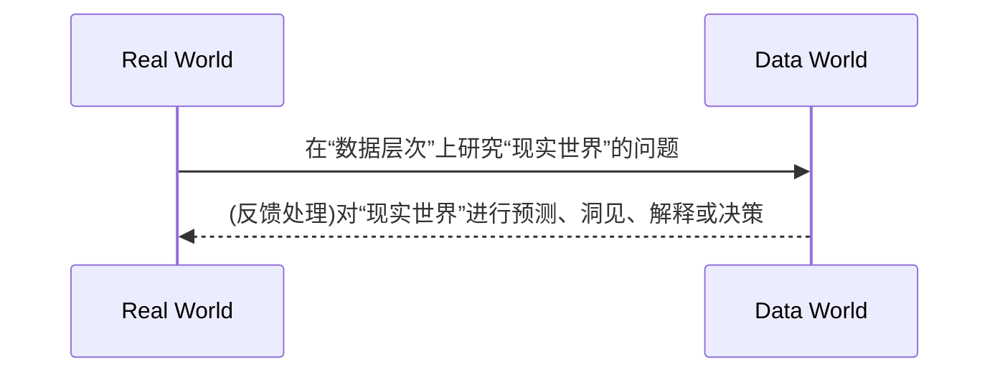

## DATA SCIENCE
# 1. Introduction to Data Sciencce

- 第四范式

   实验科学 -> 理论科学 -> 计算科学 -> 数据密集型科学发现

在数据科学中，各种符号（如字符、数字等）的组合、语音、图形、图像、动画、视频、多媒体等统称为数据.

|类型	|含义	|本质|	举例|
|---|---|---|---|
|结构化数据	|直接可以用传统关系数据库存储和管理的数据	|先后结构，后有数据	|关系数据库中的数据
|非结构化数据|	无法用关系数据库存储和管理的数据|	没有（或难以发现）统一结构的数据	|语音、图像文件
|半结构化数据	|经过一定转换处理后可以用传统关系数据库存储和管理的数据。|	先后数据，后有结构（或较容易发现其结构）|	HTML、XML文件等|

- level of data processing: 0原始数据 1干净数据 2增值数据 3洞见数据

- 数据科学是以数据为中心的科学

以“数据”，尤其是**“大数据”**为研究对象是一门，并以统计学、机器学习、数据可视化等为理论基础，主要研究数据预处理、数据管理、数据计算等活动的交叉性学科。

## Big data

美国国家科学基金会定义大数据为“大型、多样、复杂的、纵向的，和/或基于仪器、传感器、互联网交易、电子邮件、视频和点击流等产生的分布式数据集，和/或所有现在和未来可用的其他数字源”。

- 两个内涵

      1.研究数据本身，研究数据的各种类型、状态、属性及变化形式和变化规律；

      2.为自然科学和社会科学研究提供一种新的方法，称为科学研究的数据方法，其目的在于揭示自然界和人类行为现象和规律。

- Process of data science

## Machine Learning(ML)

机器学习(Machine Learning, ML)是一门多领域交叉学科，涉及概率论、统计学、逼近论、凸分析、算法复杂度理论等多门学科。专门研究计算机怎样模拟或实现人类的学习行为，以获取新的知识或技能，重新组织已有的知识结构使之不断改善自身的性能。

## Common tools
!!! info "Common tools"
      - 数据科学语言工具：R、PYTHON、CLOJURE、HASKELL、SCALA等
      - 传统数据库和数据仓库工具：SQL、RDMS、DW、OLAP等
      - NOSQL工具：MONGODB、COUCHBASE、CASSANDRA等
      - 支持大数据计算的工具：HADOOP HDFS&MAPREDUCE、SPARK、STORM等
      - 支持大数据管理、存储和查询的工具：HBASE、PIG、HIVE、IMPALA、CASCALOG- 等
      - 支持数据采集、聚合或传递的工具：WEBSCRAPER、FLUME、AVRO、SQOOP、HUME- 等
      - 支持数据挖掘的工具：WEKA、KNIME、RAPIDMINER、SCIPY、PANDAS等
      - 支持数据可视化的工具：GGPLOT2、D3.JS、TABLEU、SHINY、FLARE、GEPHI等
      - 数据统计分析工具：SAS、SPSS、MATLAB等

1.NoSQL

{==不需要固定的表结构，通常也不存在连接操作。在大数据存取上具备关系型数据库无法比拟的性能优势==}

非关系型数据库以键值对存储，它的结构不固定，每一个元组可以有不一样的字段，每个元组可以根据需要增加一些自己的键值对，这样就不会局限于固定的结构，可以减少一些时间和空间的开销。

2.Hadoop

3.SPARK

## Basic steps
!!! success "Basic steps"
      - 掌握数学、统计学及计算机科学、机器学习
      - 拥抱AI大模型技术
      - 学会写代码
      - 掌握数据库技术：RDBMS,NOSQL
      - 探究数据科学流程
      - 重视大数据
      - 成长、协作与学习
      - 参与实际工作，彻底投入实践
      - 参与社区

# 2. Visualazaiton Tech

**visualization**:data info -> visual formation

 - components:
      1. spatial sub - strate(空间基)
      2. graph ele (图形元素)
      3. graph (图形属性)

- R 

      - defaulted: graphics 

      - most powerful one: ggplot2

         ~~~R
         # installment
         
         ~~~

!!! note "basic graphics"

      1. 散点图(scatter)

         can be used to indicate underlying connections bet. parameters( dep. on the dimentionary of them). Usually applied f 2d statistics in a *Catesian* codt.(coordination).

      2. 折线图

      3. 条形图/柱形图(bar)

         includes dif. color, length, fill etc. to perform *same&diffenrence* among multiple statistics.

      4. 饼图(pie)

      5. 直方图(histogram)

         display the statistic characteristics(PDF)

      6. 箱线图(box-plot)

- advanced graphics

  1. 热力图(hitmap)

     display cross level, both horizonal direction and vertical direction(multiple comparison). It can be allaied with cluster graphics

  2. 

- ggplot2

  from *specific statistics* to *geometry objects(geom)*

  ~~~
  plot - aesthetics - geometry
  ~~~

  **R** can save the drawing process(use "/*+..." to append more set) -> overlap other layers

  ~~~R
  # initial-> build layers -> adjust
  # common aesth.: axis(x,y), color, size, shape, fill, alpha(透明度)
  
  # scatter
  # statistics transform
  ggplot(mpg, aes(trans, cty))+
  geom_point()+
  geom_point(stat = "summary", fun = "mean", color = "red", size = 4) # apply another graph above the former ones
  
  
  ~~~

## Map

~~~ R
install.packages("maps")
install.packages("mapproj")
library(maps)
library(ggplot2)
states_map <- map_data("state") # load data and write into virable

ggplot(states_map, aes(x=long,y=lat,group=group)) +
geom_polygon(fill="white",colour="black") # 绘制多边形, 可以填充颜色

ggplot(states_map, aes(x=long,y=lat,group=group)) +
geom_path() + coord_map("mercator") # 绘制路径
~~~

## Network(网络图)

使用igraph包. igraph 是一个项目，目标是建立一条简单，易用的网络分析工具，有 R, python, C/C++ 等语言的具体实现。

- 安装包: 
~~~R
install.packages("igraph") 
library(igraph)
~~~
- 有向图无向图:
~~~R
# 有向图
gd <- graph(c(1,2, 2,3, 2,4, 1,4, 5,5, 3,6))
plot(gd)
# 无向图
gu <- graph(c(1,2, 2,3, 2,4, 1,4, 5,5, 3,6),directed=FALSE)
plot(gu,vertex.label=NA)
~~~

## Output Format

- "PDF"
~~~R
# 使用pdf()打开pdf图形设备，绘制图形，dev.off()关闭图形设备。
pdf("d:/myplot.pdf",width=4,height=4)
print(ggplot(mtcars,aes(x=wt,y=mpg))+geom_point())
# 或者plot(mtcars$wt,mtcars$mpg)
dev.off()
~~~
      
- "png"
~~~R
# 用png()打开png图形设备，绘制图形，dev.off()关闭图形设备。
ppi <- 300
png("d:/myplot_%d.png",width=4*ppi,height=4*ppi,res=ppi)
plot(mtcars$wt,mtcars$mpg)
print(ggplot(mtcars,aes(x=wt,y=mpg))+geom_point())
dev.off()
~~~

# 3. R

- 安装包: install.packages()
- [R学习资源网站💻](https://www.w3cschool.cn/r/r_overview.html)