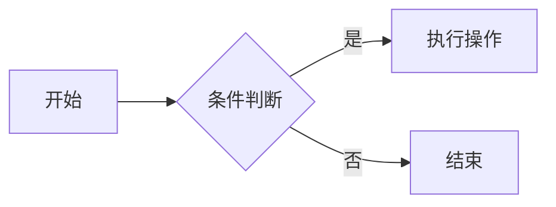
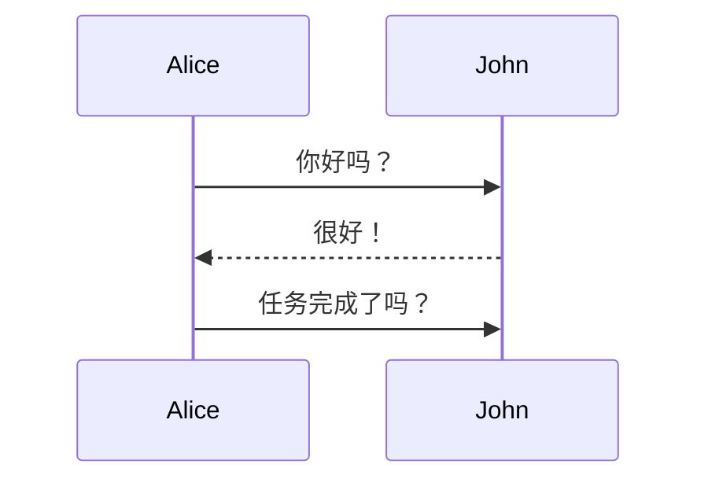
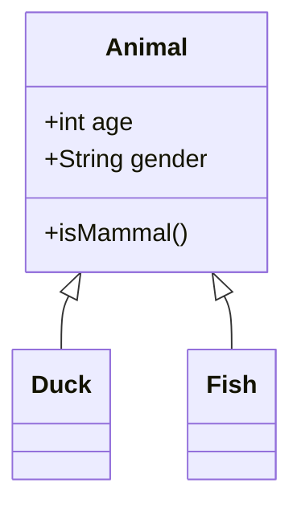

## Pamphlet

# 1. Math

## Using block syntax
$$
\cos x=\sum_{k=0}^{\infty}\frac{(-1)^k}{(2k)!}x^{2k}
$$

## Using inline block syntax
The homomorphism $f$ is injective if and only if its kernel is only the
singleton set $e_G$, because otherwise $\exists a,b\in G$ with $a\neq b$ such
that $f(a)=f(b)$.

## Comparison
When deciding between MathJax and KaTeX, there are several key factors to consider:

- Speed: KaTeX is generally faster than MathJax. If your site requires rendering large quantities of complex equations quickly, KaTeX may be the better choice.

- Syntax Support: MathJax supports a wider array of LaTeX commands and can process a variety of mathematical markup languages (like AsciiMath and MathML). If you need advanced LaTeX features, MathJax may be more suitable.

- Output Format: Both libraries support HTML and SVG outputs. However, MathJax also offers MathML output, which can be essential for accessibility, as it is readable by screen readers.

- Configurability: MathJax provides a range of configuration options, allowing for more precise control over its behavior. If you have specific rendering requirements, MathJax might be a more flexible choice.

- Browser Support: While both libraries work well in modern browsers, MathJax has broader compatibility with older browsers. If your audience uses a variety of browsers, including older ones, MathJax might be a safer option.

In summary, KaTeX shines with its speed and simplicity, whereas MathJax offers more features and better compatibility at the expense of speed. The choice between the two will largely depend on your specific needs and constraints.

# 2. Git Commands
```dash
# 🚀 Basic Git Operations
git init                                  # Initialize a new Git repository
git clone https://github.com/user/repo.git # Clone a remote repository
git status                                # Check the current status
git add filename                          # Add a specific file to staging
git add .                                 # Add all changes in the current directory
git commit -m "Descriptive message"        # Commit staged changes
git log                                   # View commit history

# 🔄 Branching and Merging
git branch branch_name                    # Create a new branch
git checkout branch_name                  # Switch to the specified branch
git switch branch_name                    # Alternative to checkout (newer Git versions)
git checkout -b new_branch                 # Create and switch to a new branch
git merge branch_name                     # Merge a branch into the current one
git branch -d branch_name                  # Delete a local branch

# 🚀 Working with Remotes
git remote add origin https://github.com/user/repo.git  # Add a remote repository
git push origin branch_name                            # Push changes to the remote branch
git pull origin branch_name                            # Pull updates from the remote branch

# 🕵️ Inspecting Changes
git diff                                  # View changes between working directory and last commit
git diff --staged                         # View changes that have been staged for commit

# 🔧 Advanced Tips
git stash                                 # Stash changes temporarily
git stash apply                           # Apply stashed changes
git revert commit_hash                    # Undo a previous commit with a new commit
git reset --hard commit_hash              # Reset to a specific commit (destructive)
git reset --soft HEAD~1                    # Undo the last commit but keep changes
git rm --cached filename                   # Untrack a file without deleting it locally
git log --oneline                          # View commit history in a compact format
git diff branch1..branch2                  # View differences between two branches
git rebase branch_name                     # Rebase current branch onto another branch

```

# 3. Annotations
When SuperFences is enabled, annotations can be nested inside annotations by adding the annotate class to the list item hosting the annotation content, repeating the process:

Lorem ipsum dolor sit amet, (1) consectetur adipiscing elit.
{ .annotate }

1.  :man_raising_hand: I'm an annotation! (1)
    { .annotate }

    1.  :woman_raising_hand: I'm an annotation as well!

## in admonitions
The titles and bodies of admonitions can also host annotations by adding the annotate modifier after the type qualifier, which is similar to how inline blocks work:

!!! note annotate "Phasellus posuere in sem ut cursus (1)"

    Lorem ipsum dolor sit amet, (2) consectetur adipiscing elit. Nulla et
    euismod nulla. Curabitur feugiat, tortor non consequat finibus, justo
    purus auctor massa, nec semper lorem quam in massa.

1.  :man_raising_hand: I'm an annotation!
2.  :woman_raising_hand: I'm an annotation as well!

## in content tabs
Content tabs can host annotations by adding the `annotate` class to the block of a dedicated content tab (and not to the container, which is not supported):

=== "Tab 1"

    Lorem ipsum dolor sit amet, (1) consectetur adipiscing elit.
    { .annotate }

    1.  :man_raising_hand: I'm an annotation!

=== "Tab 2"

    Phasellus posuere in sem ut cursus (1)
    { .annotate }

    1.  :woman_raising_hand: I'm an annotation as well!

# 4. Admonitions
## Usage
Admonitions follow a simple syntax: a block starts with !!!, followed by a single keyword used as a type qualifier. The content of the block follows on the next line, indented by four spaces:

!!! note

    Lorem ipsum dolor sit amet, consectetur adipiscing elit. Nulla et euismod
    nulla. Curabitur feugiat, tortor non consequat finibus, justo purus auctor
    massa, nec semper lorem quam in massa.

By default, the title will equal the type qualifier in titlecase. However, it can be changed by adding a quoted string containing valid Markdown (including links, formatting, ...) after the type qualifier:

!!! note "Phasellus posuere in sem ut cursus"

    Lorem ipsum dolor sit amet, consectetur adipiscing elit. Nulla et euismod
    nulla. Curabitur feugiat, tortor non consequat finibus, justo purus auctor
    massa, nec semper lorem quam in massa.

Similar to changing the title, the icon and title can be omitted entirely by adding an empty string directly after the type qualifier.

!!! note ""

    Lorem ipsum dolor sit amet, consectetur adipiscing elit. Nulla et euismod
    nulla. Curabitur feugiat, tortor non consequat finibus, justo purus auctor
    massa, nec semper lorem quam in massa.

## Nested admonitions
!!! note "Outer Note"

    Lorem ipsum dolor sit amet, consectetur adipiscing elit. Nulla et euismod
    nulla. Curabitur feugiat, tortor non consequat finibus, justo purus auctor
    massa, nec semper lorem quam in massa.

    !!! note "Inner Note"

        Lorem ipsum dolor sit amet, consectetur adipiscing elit. Nulla et euismod
        nulla. Curabitur feugiat, tortor non consequat finibus, justo purus auctor
        massa, nec semper lorem quam in massa.

## Collapsible blocks

When Details is enabled and an admonition block is started with ??? instead of !!!, the admonition is rendered as an expandable block with a small toggle on the right side:

??? note

    Lorem ipsum dolor sit amet, consectetur adipiscing elit. Nulla et euismod
    nulla. Curabitur feugiat, tortor non consequat finibus, justo purus auctor
    massa, nec semper lorem quam in massa.

## Inline blocks

Admonitions can also be rendered as inline blocks (e.g., for sidebars), placing them to the right using the inline + end modifiers, or to the left using only the inline modifier:

!!! info inline "Lorem ipsum"

    Lorem ipsum dolor sit amet, consectetur
    adipiscing elit. Nulla et euismod nulla.
    Curabitur feugiat, tortor non consequat
    finibus, justo purus auctor massa, nec
    semper lorem quam in massa.

!!! info inline end "Lorem ipsum"

    Lorem ipsum dolor sit amet, consectetur
    adipiscing elit. Nulla et euismod nulla.
    Curabitur feugiat, tortor non consequat
    finibus, justo purus auctor massa, nec
    semper lorem quam in massa.

`Important`: admonitions that use the inline modifiers must be declared prior to the content block you want to place them beside. If there's insufficient space to render the admonition next to the block, the admonition will stretch to the full width of the viewport, e.g., on mobile viewports.

## Supported types

```admonition
note, abstract, info, tip, success, question, warning, 
failure, danger, bug, example, quote
```
- review

!!! note "note"
    这是该样式的演示
!!! abstract "abstract"
    这是该样式的演示
!!! info "info"
    这是该样式的演示
!!! tip "tip"
    这是该样式的演示
!!! success "success"
    这是该样式的演示
!!! question "question"
    这是该样式的演示
!!! warning "warning"
    这是该样式的演示

!!! failure "failure"
    这是该样式的演示
!!! danger "danger"
    这是该样式的演示
!!! bug "bug"
    这是该样式的演示
!!! example "example"
    这是该样式的演示
!!! quote "quote"
    这是该样式的演示

# 5. Icons (Material Icons)
:material-home: Home 
:material-github: GitHub 

# 6. Emojis
:tada:  :rocket:  :smile:  :fire:  

# 7. Formatting

When Critic is enabled, Critic Markup can be used, which adds the ability to highlight suggested changes, as well as add inline comments to a document:

```
Text can be {--deleted--} and replacement text {++added++}. This can also be
combined into {~~one~>a single~~} operation. {==Highlighting==} is also
possible {>>and comments can be added inline<<}.

{==

Formatting can also be applied to blocks by putting the opening and closing
tags on separate lines and adding new lines between the tags and the content.

==}
```

Text can be {--deleted--} and replacement text {++added++}. This can also be
combined into {~~one~>a single~~} operation. {==Highlighting==} is also
possible {>>and comments can be added inline<<}.

{==

Formatting can also be applied to blocks by putting the opening and closing
tags on separate lines and adding new lines between the tags and the content.

==}

# 8. Content Tabs

When a content tab contains more than one code block, it is rendered with horizontal spacing. Vertical spacing is never added, but can be achieved by nesting tabs in other blocks:

```
=== "Unordered list"

    * Sed sagittis eleifend rutrum
    * Donec vitae suscipit est
    * Nulla tempor lobortis orci

=== "Ordered list"

    1. Sed sagittis eleifend rutrum
    2. Donec vitae suscipit est
    3. Nulla tempor lobortis orci
```
=== "Unordered list"

    * Sed sagittis eleifend rutrum
    * Donec vitae suscipit est
    * Nulla tempor lobortis orci

=== "Ordered list"

    1. Sed sagittis eleifend rutrum
    2. Donec vitae suscipit est
    3. Nulla tempor lobortis orci

When SuperFences is enabled, content tabs can contain arbitrary nested content, including further content tabs, and can be nested in other blocks like admonitions or blockquotes.

```
!!! example

    === "Unordered List"

        ``` markdown
        * Sed sagittis eleifend rutrum
        * Donec vitae suscipit est
        * Nulla tempor lobortis orci
        ```

    === "Ordered List"

        ``` markdown
        1. Sed sagittis eleifend rutrum
        2. Donec vitae suscipit est
        3. Nulla tempor lobortis orci
        ```
```
!!! example

    === "Unordered List"

        ``` markdown
        * Sed sagittis eleifend rutrum
        * Donec vitae suscipit est
        * Nulla tempor lobortis orci
        ```

    === "Ordered List"

        ``` markdown
        1. Sed sagittis eleifend rutrum
        2. Donec vitae suscipit est
        3. Nulla tempor lobortis orci
        ```

# 9. Task Lists
- [x] Task 1  
- [ ] Task 2  

# 10. Mermaid Diagrams


流程图


序列图


类图



