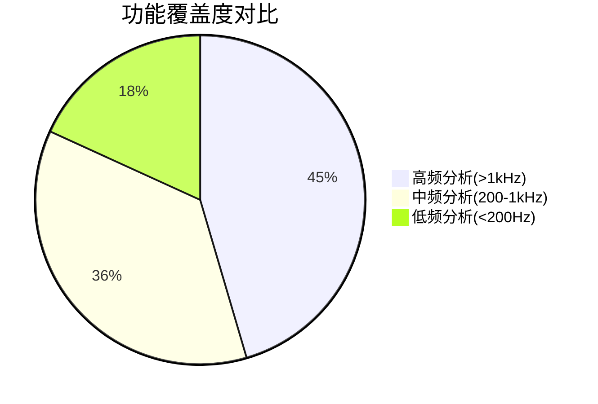
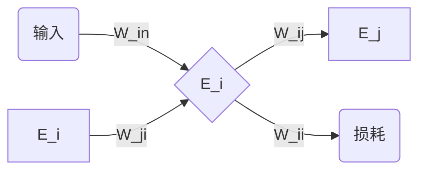

## Room Acoustics

# 0. 商用软件

## VA One
- VA One vs AutoSEA2

=== "核心架构对比"

    | 特性                | VA One                              | AutoSEA2                          |
    |---------------------|-------------------------------------|-----------------------------------|
    | **开发公司**        | ESI Group                           | 原MSC Software (现并入Hexagon)    |
    | **求解器基础**      | SEA + Hybrid FE-SEA                 | 经典SEA                           |
    | **最新版本**        | 2023版                              | 已停止更新 (最终版2019)           |

=== "工程应用场景"
    ✅ VA One优势场景 • 航天器全频段振动分析 • 新能源汽车NVH预测 • 船舶水下辐射噪声模拟  

    ✅ AutoSEA2适用场景 • 传统汽车高频噪声分析 • 建筑隔声性能评估 • 机械系统高频振动传递

功能差异点

# 4. 扩散声场和混响声场

# 5. 室内声场的数值建模与仿真

## 声线跟踪法（Ray Tracing）

- 定义

    声线跟踪法是一种基于几何声学的声场模拟方法，通过追踪声波传播路径（声线）来预测声场分布，常用于建筑声学、虚拟现实音频渲染等领域。

=== "基本原理"

    1. **声线近似**  
    假设声波波长 << 障碍物尺寸时，声波可近似为粒子沿直线传播
    2. **能量衰减模型**  
    声线能量随距离衰减：\( E(r) = E_0 \cdot \frac{1}{r^2} \)
    3. **反射定律**  
    声线在界面反射时满足：入射角 = 反射角

=== "应用场景"
    - 建筑声学设计（音乐厅、剧院）
    - 虚拟现实空间音频生成
    - 噪声控制工程模拟

=== "优缺点"
    ✅ **优势**  
    - 物理意义直观
    - 适合复杂几何场景
    - 并行计算友好  

    ❌ **局限**  
    - 忽略波动效应（干涉、衍射）
    - 高频精度优于低频
    - 计算量随反射次数指数增长

!!! info "算法流程"
    1. **声线发射**  
        - 从声源向随机方向发射多条声线
        - 常用蒙特卡洛法确定发射方向
    2. **路径追踪**  
        - 检测声线与场景物体的碰撞
        - 唯一碰撞点的记录
        - 能量阈值的控制
        - 记录反射/衍射次数（最大反射次数 $n_{max}$ 需预设）
    3. **能量累积**  
        - 接收点统计所有经过声线的能量贡献
        - 考虑空气吸收：\(E = E_0 \cdot e^{-\alpha r}\)
        - 全部跟踪结束, 输出数据

- 声源

    声功率为\(L_W\)的点声源,声线能量\(W_i = \frac{1}{N} 10^{(\frac{L_W}{10} - 12)}\).{++指向性复杂时,要考虑空间分布++}

    {==针对全向声源==}, z方向取等分圆环,再控制弧长, 从**经纬**方向近似**球面**的均匀分布.任意声线方向 (1) \(V_{ij}\), 再结合具体的点坐标, 由点法式方程可得声线方程.
    { .annotate }

    1.  
        \[
        \theta_i = \frac{2i - 1}{2n} \pi \text{纬度圈**近似**为轴向角的划分数}
        \]

        \[
        \phi_{ij} = \frac{2j - 1}{2 m_i} 2 \pi \text{经度圈**准确**为空间角的划分数}    
        \]

- 墙面

    一般认为墙面是空间内的平面\(ax + by + cz  + d = 0\), 再结合空间几何的知识可以分析如法向量等几何量.

    - 声线与墙面交点

        先计算点到平面距离"l" (1) , 再把这个参数引入到一个参数方程组 (2) , 则得到交点坐标
        { .annotate }

        1. \[
                l = - \frac{ax_1 + by_1 + cz_1 + d}{a\alpha + b\beta + c\gamma}
            \]

            但在这个具体场景中, l是恒大于零的, 因为在几何声学假定下, 声线无法穿透墙面. 同时对应着源点在平面内部, 且切向量指向平面法相.

        2. \[
                \begin{cases}
                x = x_1 + \alpha l\\
                y = y_1 + \beta l\\
                z = z_1 + \gamma l
                \end{cases}
                ,\quad
                \mathbf{x} = \mathbf{x_1} +  t \mathbf{V}
            \]
---
- 反射声线

    能量\(W_i(t) = W_i(t-t_1)(1 - \alpha)\), 方向为 (1) \(\mathbf{t_2} = \mathbf{t_1} - 2 \cos(\frac{\Delta}{2}) \mathbf{n}\)
    { .annotate }

    1. 
        这里的情况就是射线向平面外侧的方向射进界面, 反射回平面内部空间, 且这个角度\(\Delta\)值的是两个射线方向向量的夹角, 而非简单的"入射角 + 反射角", 如果是那样, 将会变为\(\sin(\frac{\Delta}{2})\)

### 对比虚声源法
!!! success "比较"
    1.**虚声源法**

    适用于{==简单==}空间, 特别是规则的矩形空间, 同时能能计算{==能量和声压脉冲响应==}, 对于镜面反射的模拟精度很高, 但是计算效率较低.

    2.**声线跟踪法**
    {==适用于任意空间的高频声学仿真==}, 能够计算指定定点的能量和声压脉冲响应, 计算精度取决于{==反射条件和接收圆半径==}.

### 辐射度法

### 统计能量分析

- 原理

    系统: 建模的实际物理系统

    子系统: 继承原有系统属性的一组模态

